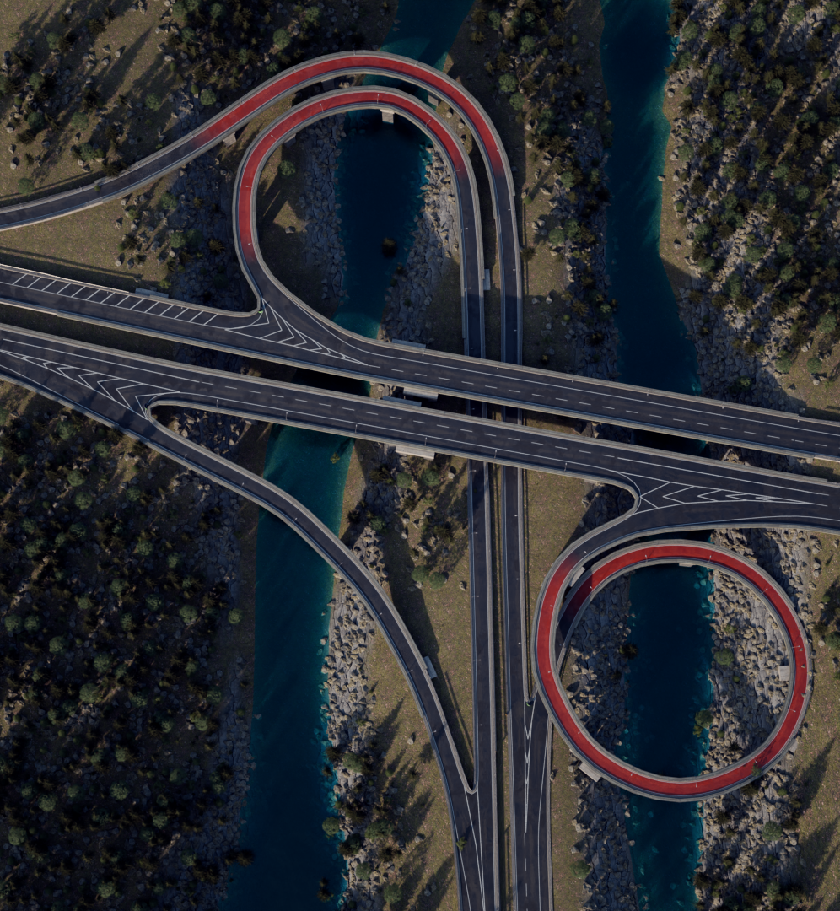
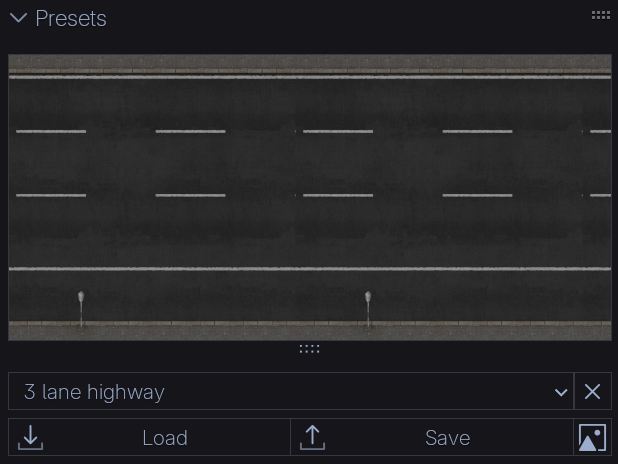

# Road Tools

<table style="width:100%;border-collapse:collapse;">
  <tr>
    <td style="width:50%;vertical-align:top;padding-right:16px;">
      
    </td>
    <td style="width:50%;vertical-align:top;">
      

        
<strong>Road Tools</strong> is a Blender add-on for generating fully customizable road networks. It turns simple edges and points into detailed streets, intersections, and highways with just a few clicks.

        <ul>
          <li>Create straight segments, smooth curves, and complex intersections</li>
          <li>Snap new roads precisely with adjustable angle snapping</li>
          <li>Customize road width, color, wetness, and surface details per segment</li>
          <li>Add traffic lights, crosswalks, and streetlamps </li>
          <li>Save, load, and manage presets for reusable designs</li>
          <li>Compatible with Blender 4.x+</li>
        </ul>
      

    </td>
  </tr>
</table>

## Quick Install
1. Download the `.zip` from [Blender Market](https://blendermarket.com/your-addon).
2. In Blender: `Edit > Preferences > Add-ons > Install...`
3. Select the `.zip` and enable **Road Tools**.

## Usage

### Add Road Object

To get started, open the **3D Viewport** and press **N** to open the side panel.  
Go to the **Road Tools** subpanel and click **Add New Road Object**.  
This appends a default road object along with its assets.

---

### Presets

This panel lets you **load and save road presets**.  
The add-on comes with a few pre-made presets. In Edit Mode, select the edges you want to apply the preset to, then choose one from the dropdown menu.  
If the preset doesn’t load automatically, press the **Load** button.

#### Preset Customization
While in Edit Mode, a subpanel called **Customize Road** is available.  
Here you can fine-tune the selected road edges.

> **Note:** Customizing road edges only changes the selected edges. It does not overwrite the preset itself.

- To apply changes, press **Apply Customizations**.  
- To see changes live, enable the **Live Update Toggle** (the white circle next to Apply).  
  - Live Update applies changes instantly but leaves all customization menus visible, even if they don’t apply to the current road type.  

#### Save Custom Presets
After customizing a road, you can save it as a new preset.  
- Make sure **Live Update** is turned off.  
- Select the customized edge and press **Save**.  
- You can upload a custom thumbnail by pressing the square **image button** next to Save.  

#### Delete Presets
To delete a preset (except **!Default**):  
- Select it from the dropdown menu.  
- Press the **X** button next to the dropdown.  

---

### File Paths
Road presets and thumbnails are stored here:

**Windows**
- Presets:  
  `C:\Users\<YourName>\AppData\Roaming\Blender Foundation\Blender\<version>\scripts\addons\road_tools\road_presets.json`  
- Images:  
  `C:\Users\<YourName>\AppData\Roaming\Blender Foundation\Blender\<version>\scripts\addons\road_tools\images`

**macOS**
- Presets:  
  `/Users/<YourName>/Library/Application Support/Blender/<version>/scripts/addons/road_tools/road_presets.json`  
- Images:  
  `/Users/<YourName>/Library/Application Support/Blender/<version>/scripts/addons/road_tools/images`

**Linux**
- Presets:  
  `/home/<YourName>/.config/blender/<version>/scripts/addons/road_tools/road_presets.json`  
- Images:  
  `/home/<YourName>/.config/blender/<version>/scripts/addons/road_tools/images`

---

### Draw Road

     
Road Tools includes two drawing tools: **Straight** and **Turn**.

- **Straight Tool**  
  1. Click the **Straight** button.  
  2. Hover over a vertex of your road object until a green dot appears.  
  3. Left-click to start drawing, and left-click again to confirm the segment.  

- **Turn Tool**  
  1. Click the **Turn** button.  
  2. Left-click to start drawing.  
  3. Second left-click sets the arc point.  
  4. Third left-click confirms the curve.  

> **Warning:** Sometimes the **Turn** tool creates overly dense meshes, which may break intersections.  
> To fix this, dissolve vertices that are too close together with `Ctrl + X`.

#### Angle Snapping
The **Angle Snapping** tool lets you create precise road shapes by snapping new segments to a fixed angle relative to the previous road edge.  

- The default snap angle is **5°**.  
- To set a custom angle, enable **Custom** and enter your preferred value.  

---

### Edit Road

     
The **Edit Road** subpanel lets you customize the properties of intersections and road segments independently of presets.

**For Points:**
- **Radius** – Adjusts the size of an intersection (values range from -10 to 10).
- **Toggle Traffic Lights** – Adds or removes working traffic lights from the intersection.  
  To change the **global cycle duration** of traffic lights:  
  1. Select the road object.  
  2. Open the **Geometry Node Editor**.  
  3. Enter the **Global Values** node group by pressing `TAB`.  
  4. Adjust the **Traffic Light Cycle Duration** value (default is 3).

**For Edges:**
- **Segment Offset** – Offsets the road segment along its width.  
- **Switch Road Direction** – Reverses the traffic direction (for one-way streets only). Useful when creating highways or interchanges.  
- **Toggle Crosswalks** – Enables or disables crosswalks on the selected segment.

### Global Values

- **Ground Object** – Selecting a ground object enables automatic bridge generation.  

- **Road Color** – Sets the global road color.  
  To make road color independent for each edge:  
  1. Go to **Object Data Properties → Attributes**.  
  2. Add a new attribute with: **Domain = Edge**, **Type = Color (Float)**.  
  3. In the **Modifiers** tab, enable the input attribute toggle (small flag icon) next to *Road Color* and pick your new attribute.  
  4. To assign different colors per edge:  
     - In **Object Data Properties**, select your new color attribute.  
     - In the viewport, select the edges you want to recolor.  
     - Press **F3 → Set Attribute** and choose a color.  

- **Road Wetness %** – Controls the overall wet appearance of roads.  
  *(Note: wetness is not present in tunnels.)*  

- **Leaves** – Adds scattered leaves to the road surface.  
  *(Note: leaves are not present in tunnels.)*  

- **Streetlamps On/Off** – Toggles the streetlamp lights.

---

### Bake Road

- **Bake Road** – Bakes the road geometry using the Geometry Nodes bake system.  
  - By default, it uses **Still** mode, preserving the road as a single frame.  
  - If you want to bake animated effects (such as traffic lights changing colors), open the **Geometry Nodes Modifier**, find the **Bake Node**, and set it to **Animation** instead of Still.  

- **Delete Road** – Removes the baked road data.

